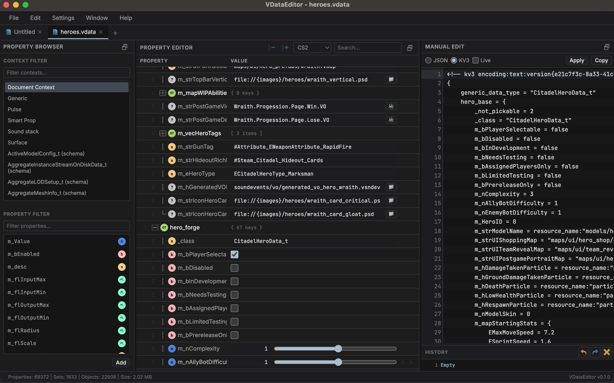

# VDataEditor

> Desktop editor for Source 2 KV3 files (`.vsmart`, `.vdata`, `.vpcf`, `.kv3`).

VDataEditor is a lightweight desktop tool for viewing, editing, and saving Source 2 data files with both raw text editing and structured property widgets. It is designed for fast iteration when working with Valve resource data and related KV3-based content.

## Screenshot

## Download

| Platform | Stable release | Latest build |
|----------|---------------|---------------|
| 🪟 Windows | [**Download .exe**](https://github.com/dertwist/VDataEditor/releases/latest) | [Latest build ↗](https://github.com/dertwist/VDataEditor/releases/tag/latest-build) |

## Project documentation

### Performance

For keeping the UI responsive (DOM, workers, Electron, profiling), see **[readme/js-performance-guide.md](readme/js-performance-guide.md)**.

### Windows 11 UI freezes (24H2+)

Some Windows 11 builds (24H2 and later, e.g. kernel `10.0.26100+`) have a **Desktop Window Manager (DWM) / multi-plane overlay** interaction issue that can make **Chromium and Electron apps** stutter or freeze on ordinary actions (menus, resize, clicks), often with a system beep. This is **not specific to VDataEditor**; it affects other Electron apps as well. macOS is unaffected.

**What VDataEditor does automatically**

- On **Windows**, if the OS build is **26100 or newer** and the effective GPU mode is **`auto`** (the default), the app applies a **Step 1** Chromium flag bundle at startup (no menu toggle — it runs before the window opens):
  - `disable-gpu-compositing`
  - `disable-gpu-vsync`
  - `disable-software-rasterizer`
  - `enable-features=UseSkiaRenderer` (exact feature availability follows the **Electron** / Chromium version in `package.json`).
- Set **`VDATA_WIN24H2_GPU_LIGHT=1`** before launch to use **only** `disable-gpu-compositing` on **26100+** instead of the Step 1 bundle (useful to compare behavior or if a flag causes regressions).
- **Overrides** (restart required after changing): set **`VDATA_GPU_MODE`** to `auto` (default), `safe`, or `software`, or add **`"gpuMode"`** to **`preferences.json`** in the app **`userData`** folder (`safe` = compositing-only on older Windows; on **26100+** uses the same Step 1 bundle as `auto` unless **`VDATA_WIN24H2_GPU_LIGHT=1`**; **`software`** = full software rendering via `disableHardwareAcceleration()`). Environment variable wins over the file.

**Quick checks on an affected PC (e.g. 26100.x)** — restart the app after each change: (1) default (Step 1), (2) **`VDATA_WIN24H2_GPU_LIGHT=1`** to see if the extra flags matter, (3) **`VDATA_GPU_MODE=software`** for maximum app-side mitigation, (4) add the **registry Step 3** below if freezes persist (often fixes all Chromium apps on that machine).

**System-level fix (recommended for all Chromium apps on that PC)**

Microsoft’s community discussion: [Windows 11 24H2 rendering / freezing with Chromium](https://techcommunity.microsoft.com/discussions/windows11/cause-and-solution-to-windows-24h2-related-renderingpartial-freezing-with-chromi/4435381).

1. Open **Registry Editor** (`Win+R` → `regedit`).
2. Go to `HKEY_LOCAL_MACHINE\SOFTWARE\Microsoft\Windows\Dwm`.
3. Create a **DWORD (32-bit)** value named **`OverlayMinFPS`** and set it to **`0`**.
4. Restart **Desktop Window Manager** (Task Manager → find “Desktop Window Manager” → End task; it restarts), or sign out / reboot.

A merge file ships with the app as **`extras/fix_win11_freeze.reg`** (also bundled next to the app in packaged builds). In the desktop app on Windows, use **Help → Windows 11 UI freezes (registry fix)…** to open that file (confirm the merge when Windows prompts). Administrator rights may be required for `HKEY_LOCAL_MACHINE`.

### Architecture

VDataEditor follows the usual Electron split:

| Layer | Role |
|--------|------|
| **Main** (`main.js`) | Window lifecycle, native dialogs, filesystem read/write, recent-files list and optional **`preferences.json`** (e.g. `gpuMode` override), IPC handlers. On Windows kernel **26100+** applies **GPU / Chromium mitigations** for DWM freezes automatically unless overridden (**`VDATA_GPU_MODE`**, file, or **`VDATA_WIN24H2_GPU_LIGHT=1`**). File-open from OS (CLI on Windows, `open-file` on macOS) forwards paths to the renderer. |
| **Preload** (`preload.js`) | Exposes a small `window.electronAPI` surface via `contextBridge` (isolated context; the renderer does not use Node directly). |
| **Renderer** (`index.html`, `style.css`, `editor.js`, …) | All UI: menus, docks, text editing, and the property tree for structured KV3 data. |

`renderer.js` is the stock Electron placeholder. In **`index.html`**, scripts load in dependency order: `format/kv3.js` and `format/keyvalue.js`, then `src/model/` (`kv3-node.js`, `kv3-document.js`), `src/formats/registry.js`, `src/settings/`, `src/modes/index.js`, `icons.js`, `vendor/cm.js`, an inline icon bootstrap, and finally **`editor.js`** (main UI).

### Text editing

**CodeMirror 6** is not pulled from `node_modules` at runtime. Source lives in `src/cm-bundle.js` and is bundled to **`vendor/cm.js`** with esbuild (`npm run build:cm`). That step runs on **`npm install`** via `postinstall`. After changing editor dependencies or `src/cm-bundle.js`, rebuild the vendor file before testing.

### Data layer

- **`format/kv3.js`** and **`format/keyvalue.js`** — parse and serialize KV3 / KeyValues text. Round-trip behavior is covered by tests; changes here should keep fixtures and assertions in sync.
- **`src/model/kv3-document.js`**, **`src/model/kv3-node.js`** — document model helpers used by the UI.
- **`src/formats/registry.js`** — maps file extension plus document shape (`generic_data_type`, particle `_class`, etc.) to **widget profiles** (labels and dispatch for the property panel). Extend `PROFILES` when adding a new typed profile.
- **`src/modes/index.js`** — property editor **mode registry**: schema hints and custom widgets per file type (`vsmart`, particle types, etc.), exposed as `window.VDataEditorModes`. Loaded before `editor.js`.
- **`src/settings/`** — widget config and system config (`widget-config.js`, `system-config.js`).

### IPC surface (`electronAPI`)

The preload exposes: file read/save, save dialog, app version, **`getPlatform`**, **`openWin11FreezeReg`** (opens the bundled DWM registry helper on Windows), recent files (get/clear/add, and `onRecentFilesUpdated`), `onOpenFile`, and window actions (quit, minimize, zoom, fullscreen). New main-process features should add a matching handler in `main.js` and a typed bridge in `preload.js`.

### Assets

- **`icons.js`** — inline SVG icons consumed by `index.html` for menus and toolbars.
- **`assets/images/`** — app icon, file-type and UI imagery referenced from HTML/CSS.

### Scripts

| Command | Purpose |
|---------|---------|
| `npm start` | Run the app with Electron. |
| `npm test` | Run **Vitest** tests under `tests/`. |
| `npm run build:cm` | Rebuild `vendor/cm.js` from `src/cm-bundle.js`. |
| `npm run build:win` | Package a Windows installer (see `package.json` `build` block). |

### File associations

Supported extensions for “open with” and CLI are defined in **`main.js`** (`OPEN_FILE_EXTENSIONS` / `OPEN_FILE_RE`) and should stay aligned with **`package.json`** `build.fileAssociations` so the packaged app and dev behavior match.

### Contributing

When you change parsing, serialization, or document structure, run **`npm test`** and update or add tests under `tests/`. Prefer edits that follow patterns and naming in the surrounding files.
