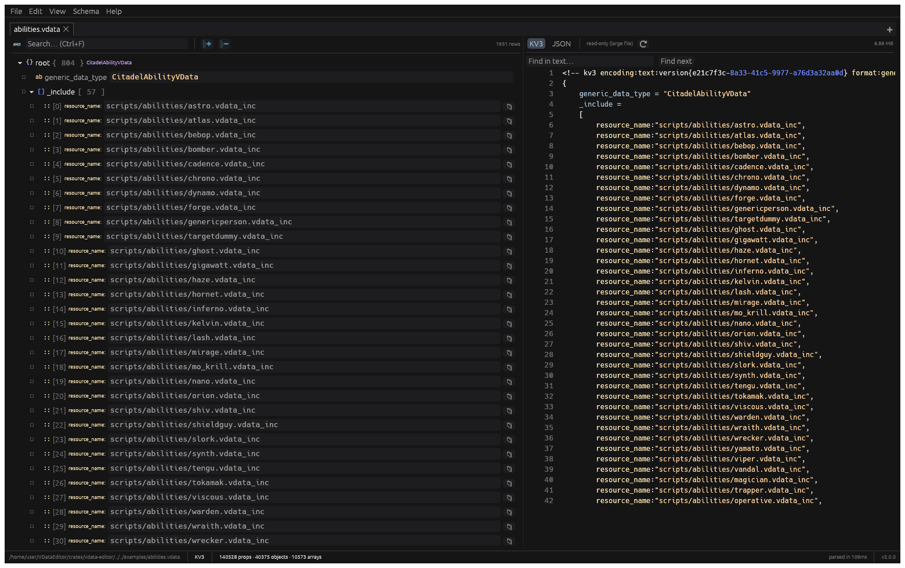

# VDataEditor

> Desktop editor for Source 2 KV3 files (`.vsmart`, `.vdata`, `.vpcf`, `.kv3`), written in Rust with [egui](https://github.com/emilk/egui) and [egui_tiles](https://github.com/rerun-io/egui_tiles).

VDataEditor is a fast desktop tool for viewing, editing, and saving Source 2 data files with both raw text editing and structured property widgets. It is designed for fast iteration when working with Valve resource data and related KV3-based content — including multi-megabyte assets like Deadlock's `abilities.vdata` (7+ MB), which parse in well under a second and render at full frame rate.

[](https://github.com/dertwist/VDataEditor/releases/latest)
[](https://github.com/dertwist/VDataEditor/actions)

## Screenshot



## Highlights

- **Native Rust application** — single static binary, no browser engine, no Node runtime. Starts instantly and stays at native speed on huge files.
- **Tiling dock UI** via `egui_tiles`: every document opens as a tab holding a property-tree pane and a raw-text pane. Panes can be dragged into any arrangement (side-by-side documents, stacked text views, …) and reset from the **View** menu.
- **Round-trip-safe KV3** — comments, typed strings (`resource_name:"…"`, `soundevent:"…"`, `panorama:"…"`), `subclass:` values, multi-line strings, and the document header all survive load → edit → save. The serializer detects and reproduces the formatting style of the original file (generic vs `modeldoc41`, Valve's split container assignment, trailing array commas).
- **Built for large data assets** — the property tree and the text view are fully virtualized; only visible rows are laid out each frame. Documents over 512 KB show a virtualized read-only text view (editing still flows through the property tree).
- **Structured editing** — type-aware widgets (checkboxes, drag-values, vector and color editors, enum dropdowns), add/duplicate/delete/rename, type casting, comment-out/uncomment, and full undo/redo with edit coalescing.
- **Schema support** — the bundled CS2 / Dota 2 / Deadlock schema dumps power enum dropdowns and are loaded on a background thread (Schema menu). Enum-like values are also harvested from the open document itself.

## File formats

| Format | Extensions |
|--------|------------|
| KV3 (text) | `.vdata`, `.vsmart`, `.vpcf`, `.kv3`, `.vsurf`, `.vsndstck`, `.vsndevts`, `.vpulse`, `.vmdl`, `.vmix`, `.vrman`, `.txt` |
| KeyValues (legacy) | `.vmat`, `.vmt` |
| JSON | `.json` |

The text pane can additionally display and apply any document as JSON.

## Building

```sh
# Run the editor (optionally pass files to open)
cargo run --release -p vdata-editor -- examples/abilities.vdata

# Run the full test suite, including the large-asset corpus
cargo test --release
```

Requires stable Rust (2024 edition). No system dependencies are needed to build; on Linux the usual X11/Wayland runtime libraries are used at runtime.

## Architecture

The repository is a Cargo workspace:

| Crate | Role |
|-------|------|
| [`crates/kv3`](crates/kv3) | Dependency-free parser/serializer for KV3 text and legacy KeyValues. Permissive (never fails; collects diagnostics), byte-oriented, and fast: ~60–110 MB/s parse throughput. |
| [`crates/vdata-editor`](crates/vdata-editor) | The application: document model, undo/redo, schema loading, and the egui/egui_tiles UI. |

Key design points:

- **Arena document model** (`vdata-editor/src/model.rs`): the parsed tree is converted into a flat arena with stable `u32` node ids. Undo commands reference ids; removed subtrees stay in the arena so undo can re-attach them.
- **Command-based history** (`history.rs`): every edit is an invertible command; rapid scalar edits (slider scrubs, typing) coalesce into one undo step (200-step cap per document).
- **Virtualized rendering** (`ui/tree.rs`, `ui/text.rs`): a cached flattened row list plus `ScrollArea::show_rows` keeps per-frame cost proportional to the visible rows, not the document size.
- **Background work**: schema parsing and file dialogs run on worker threads; the text pane resyncs ~300 ms after edits settle, so dragging a slider never blocks on serializing a 7 MB document.

## Testing

`cargo test --release` covers:

- the complete KV3 test suite ported from the original JavaScript implementation (headers, typed values, subclass, comments, block comments, modeldoc41 style);
- a round-trip corpus over every file in `examples/` — including the 7.3 MB `abilities.vdata` and 2.3 MB `heroes.vdata` — asserting parse-issue-free loads, semantic equality after re-serialization, and serializer idempotence;
- a synthetic ~50 MB / 2-million-node stress document;
- arena/undo/search unit tests and headless UI tests that drive the full application against the large assets (`crates/vdata-editor/tests/`).

## Examples & schemas

- `examples/` — real Valve sample files used by the test corpus.
- `schemas/` — class/enum dumps for CS2, Dota 2 and Deadlock (from [SchemaExplorer](https://github.com/ValveResourceFormat/SchemaExplorer)) consumed by the Schema menu.

## Contributing

When changing parsing, serialization, or the document structure, run `cargo test --release` and keep the corpus green. Prefer edits that follow the patterns and naming of the surrounding code.
